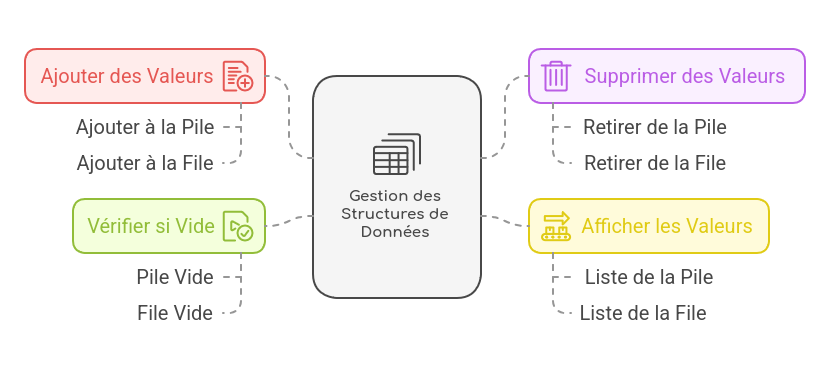

# 📌 Création et Manipulation de Pile/File


Ce projet est une application en langage C qui permet d'entrer les données de la structure de données pile ou file et d'effectuer les opérations suivantes : affichage, empilement, dépilement et vérification d'une pile/file vide.

---
## 🚀 Fonctionnalités



- Ajouter des valeurs à une pile/file.
- Supprimer une valeur dans une pile/file.
- Afficher la liste des valeurs enregistrées.
- Vérifier si la pile/file est vide.

---
## 🛠 Installation et Compilation

### 1️⃣ Cloner le dépôt
Clonez le projet depuis GitHub :
```sh
git clone https://github.com/johanalain11/pile-file.git
cd pile-file
```
### 2️⃣ Compiler le code
```sh
make
```
### 3️⃣ Exécuter l'application
```sh
./programme
```

---
## 📌 Utilisation
1. Lancez le programme.
2. Choisissez entre manipuler une pile ou une file.
3. Choisissez une opération dans le menu :
    - Enfiler/Empiler une valeur.
    - Défiler/Dépiler.
    - Afficher les valeurs.
    - Vérifier si la structure est vide.
    - Quitter le programme.

---
## 🖥 Exemple d'exécution


---
## 🔹 Structure de données

### 📌 Représentation d'une **pile** :
```c
#define index 5
struct pile
{
    int tab[index];
    int sommet;
};
typedef struct pile PILE;
```

### 📌 Représentation d'une **file** :
```c
#define index 5
struct file
{
    int tab[index];
    int sommet;
    int tete;
};
typedef struct file FI_LE;
```

---
## 🔧 Technologies Utilisées
- **Langage de programmation :** C
- **Compilateur :** GCC

---
## 🚀 Améliorations Futures
>[!NOTE]
>
>* Ajouter un système de manipulation de plusieurs piles/files.
>* Ajouter une interface graphique avec des visualisations.
>* Améliorer la validation des entrées utilisateur.
>* Gérer les erreurs comme les entrées invalides et les dépassements de mémoire.
>* Ajouter un système de sauvegarde et de chargement des données.

---
## 👤 Auteur
**Johan Alain**

[](https://github.com/johanalain11/)

