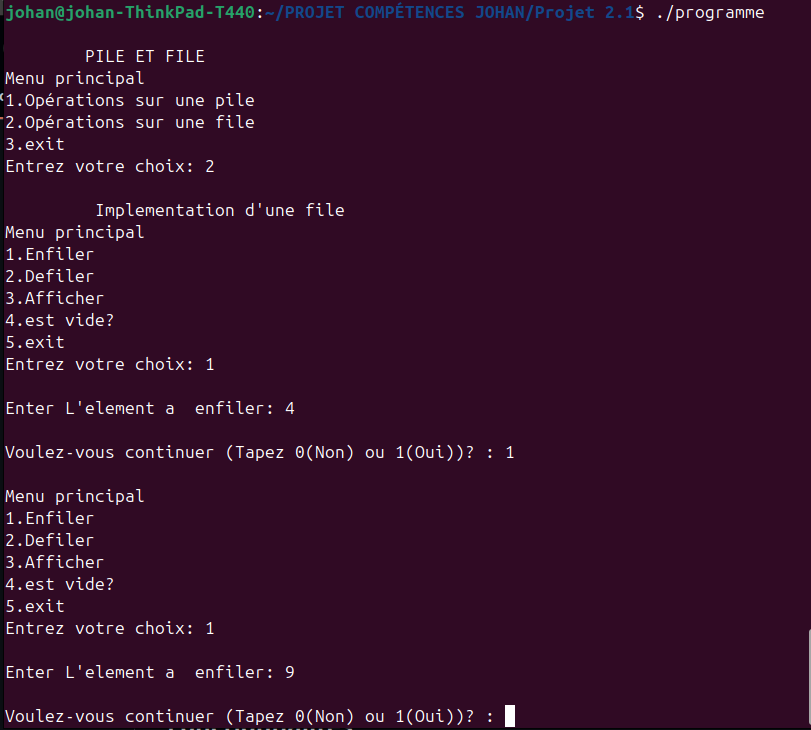

# Création et manipulation de pile/file
Ce projet est une application en langage C qui permet d'entrer les données de la structure de données pile ou file et d'effectuer les opérations d'affichage, empiler, dépiler et est vide.


## Fonctionnalités

- Ajouter des valeurs à un pile/file.
- Supprimer une valeur dans une pile/file.
- Afficher la liste des valeurs enregistrées.
- Vérifier si la pile/file est vide.

---
## Installation et Compilation

1. Cloner le dépôt
Clonez le projet depuis GitHub :
```sh
git clone https://github.com/johanalain11/pile-file.git
cd pile-file
```
2. Compiler le code
```sh
make
```
3. Exécuter l'application
```sh
./programme
```

---
## Utilisation
1. Lancez le programme.
2. Choisir de manipuler une pile ou une file
3. Choisissez une opération dans le menu :
    * Enfiler/empiler une valeur.
    * Défiler/dépiler.
    * Afficher.
    * est vide?
    * Quitter le programme.

---
## Exemple d'exécution


---
## Structure de données
Chaque pile est représenté par une structure pile :
```c
#define index 5
struct pile
{
    int tab[index];
    int sommet;
};
typedef struct pile PILE;
```
Chaque file est représenté par une structure file :
```c
#define index 5
struct file
{
    int tab[index];
    int sommet;
    int tete;
};
typedef struct file FI_LE;
```

---
## Technologies Utilisées
**Langage de programmation :** C

**Compilateur :** GCC

---
## Améliorations Futures
>[!NOTE]
>
>* Ajouter un système de manipulation de plusieurs piles/files.
>* Ajouter une interface graphique et des simulations de pile et file suivant les opérations effectuées.
>* Ajouter une validation plus robuste des entrées utilisateur.
>* Gérer les erreurs potentielles, comme des entrées invalides ou des dépassements de mémoire.
>* Ajouter un système de sauvegarde et de chargement des données dans un fichier.

## Auteur
**Johan Alain**

[GitHub](https://github.com/johanalain11/)
